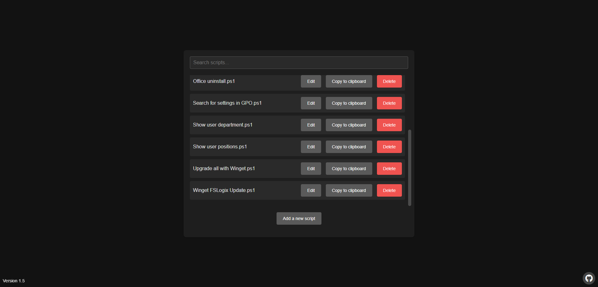

# 🎉 PS-Script: Your Daily Script Companion

Welcome to **PS-Script**! This user-friendly web application is your ultimate tool for managing and sharing scripts across all your devices. Whether you're a seasoned scripter or just getting started, PS-Script makes it easy to create, edit, and download a variety of scripts and file types with just a few clicks.

    

## 🚀 Features

- **Add a New Script** ➕: Quickly include new scripts to your collection with a simple click.
- **Edit Existing Scripts** ✏️: Easily download, rename, and modify the content and notes of your scripts.
- **File Format Support** 📂: Manage scripts in multiple formats, including `.ps1`, `.txt`, and `.bat` files.
- **Customizable Appearance** 🎨: All colors can be changed through the `colors.css` file, allowing for a personalized look that suits your style.

With PS-Script, managing your scripts has never been easier or more intuitive!

## 📜 Patch Notes

Stay updated with the latest improvements and features in PS-Script:

- **1.0**: 🎉 **Initial Release**: Welcome to PS-Script!
- **1.1**: 🚫 **Removal of Annoying Alerts**: Enjoy a smoother experience without unnecessary interruptions.
- **1.2**: 📖 **Changelog Introduced**: Keep track of all changes and updates seamlessly.
- **1.3**: 📝 **Notes Functionality Added**: Take quick notes for each script to enhance your workflow.
- **1.4**: ✏️ **Script Name Customization**: You can now change the script name to fit your needs better.
- **1.5**: 🌙 **Dark Mode & Search Bar**: Switch to Dark Mode for a stylish experience, and find your scripts effortlessly with the new search feature.
